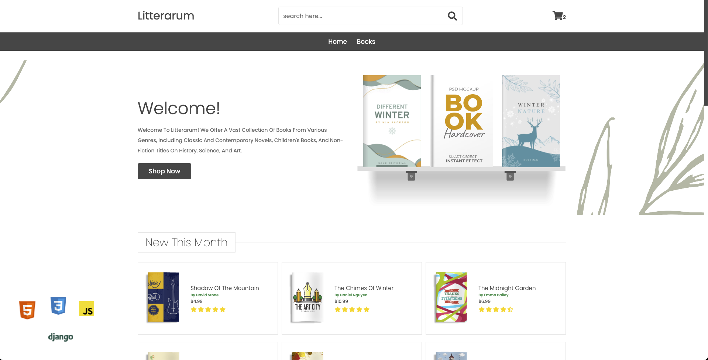

[](https://bookstore-iota-wine.vercel.app/)


## 
# Bookstore
This is a simple bookstore web app built with HTML, CSS, JS and Django(backend).


## Installation


### Prerequisites
- Python (3.x)

### Setting up the Environment

#### Windows
1. Clone the repository:
```shell
git clone https://github.com/thebugged/bookstore.git
```

2. Create a virtual environment: 
```shell
python -m venv env
```

3. Activate the virtual environment:
```shell
env\Scripts\activate
```

4. Install the dependencies:
```shell
pip install -r requirements.txt
```


#### macOS/Linux
1. Clone the repository:
```shell
git clone https://github.com/thebugged/bookstore.git
```

2. Create a virtual environment: 
```shell
python -m venv env
```

3. Activate the virtual environment:
```shell
source env/bin/activate
```

4. Install the Python dependencies:
```shell
pip install -r requirements.txt
```


## Running the App
From project directory run the Django development server:
```shell
python manage.py runserver
```

The app will be accessible at http://127.0.0.1:8000/.


